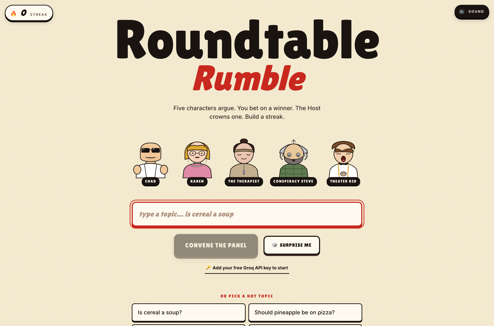

# Roundtable Rumble


A comedy panel show you play. Type any topic, and five AI characters argue it out
live: a sigma-bro, a Karen, an over-therapized millennial, a conspiracy theorist,
and a theater kid. You bet on who wins, two of them brawl, and a deadpan Host
crowns a winner. Guess right and build a streak.



## How it works

1. **Openings** — pick a topic and all five characters stream their hot take at
   once (parallel requests, so the wait is just the slowest one).
2. **Place your bet** — choose two characters to brawl, then bet on which one
   survives.
3. **The brawl** — the two trade escalating insults, each turn fed the running
   transcript so they actually respond to each other.
4. **The verdict** — the Host reads the whole thing and crowns a winner in one
   brutal one-liner. Right bet extends your streak; wrong bet burns it.

Each character is a system prompt with its own voice and hard rules (see
`app/lib/personas.ts`). Responses **stream token-by-token** from the API route
straight into speech bubbles.

## Tech stack

- **Next.js (App Router) + React + TypeScript** — UI and the streaming API route
- **Groq (Llama 3.3 70B Versatile)** — the debate engine, chosen for low latency
  so the panel feels live
- **Tailwind CSS v4** — the warm game-show theme
- **canvas-confetti** + a small Web Audio layer — wins, gavels, applause

## Run it

The debates run on Groq, and it's **bring-your-own-key**: each player pastes their
own free Groq key into the app (the 🔑 button). The key is stored only in that
browser's localStorage and sent with each request — nothing is shared and no
server key is required.

```bash
npm install
npm run build && npm start         # open http://localhost:3000
# then click "Add your free Groq API key" and paste a key from
# https://console.groq.com/keys
```

Optionally, for local dev you can set a fallback server key in `.env.local`
(`GROQ_API_KEY=...`) so you don't have to paste one each time.

> Note: this project uses a customized Next.js whose dev server (`npm run dev`)
> has a broken hot-reload socket. Use `npm run build && npm start` to run it.

## Project layout

```
app/
  api/debate/route.ts   # streaming Groq endpoint (opening / duel / verdict modes)
  components/           # DebateView (the state machine) + scene/UI pieces
  lib/
    brand.ts            # the show name — change it in one place
    personas.ts         # the five characters + the Host, as system prompts
    topics.ts           # starter topics + "surprise me"
    streak.ts           # localStorage win/loss streak
```

## Notes

- Everything is fictional comedy; the characters are broad archetypes, not real
  people.
- The show name lives in `app/lib/brand.ts` — rename the whole app from there.
